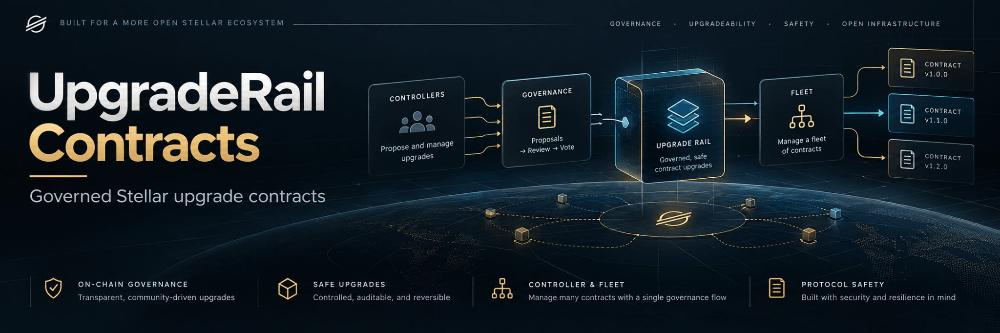

<p align="center">
  
</p>

# UpgradeRail Contracts

<p align="center">
  <a href="https://github.com/UpgradeRail/upgraderail-contracts/actions/workflows/ci.yml"></a>
  <a href="LICENSE"></a>
</p>

UpgradeRail Contracts is the on-chain governance and execution layer for governed Soroban upgrades. `UpgradeController` manages CAP-85 executable references through explicit proposals, approval thresholds, timelocks, and auditable execution.

<p align="center">
  <a href="https://upgraderail.github.io/">Documentation</a> |
  <a href="https://github.com/UpgradeRail/upgraderail-engine">Engine</a> |
  <a href="https://github.com/UpgradeRail/upgraderail-console">Console</a> |
  <a href="deployments/testnet.json">Testnet evidence</a> |
  <a href="SECURITY.md">Security</a>
</p>

## What it does

The `UpgradeController` contract owns CAP-85 executable references for fleets of contracts. It stores a fleet ID and tag, while fleet membership is tracked off-chain. Changing the reference updates the executable used by every attached contract at its next invocation.

```text
approvers -> proposal and manifest hash -> threshold -> timelock
                                                    -> permissionless execution
                                                    -> CAP-85 reference update
                                                    -> all attached instances
```

The controller stores a 32-byte manifest hash so clients can connect an executed change to the report the approvers reviewed. It does not interpret or endorse the report. UpgradeRail does not analyze WASM or run simulations on-chain. `upgraderail-engine` produces analysis and release manifest commitments, while `upgraderail-console` provides the API, indexer, team management, and user interface.

## Why it exists

A Soroban contract can use an executable reference owned by another contract. The owner stores a tag that points to an uploaded WASM hash. Changing that reference changes the executable used by every contract attached to it. CAP-85 allows a reference owner to change executable code for attached contracts. UpgradeRail does not eliminate that authority. It makes the authority rule-based, delayed, multi-party, and auditable.

## Governance flow

The constructor installs a `GovernancePolicy`, starts governance epoch and controller version at 1, and creates no administrator. A policy has 1 to 20 unique approvers, a threshold within that count, a positive timelock, and a proposal lifetime longer than the timelock. The lifetime plus a 17,280-ledger safety buffer must fit the supported TTL maximum. Fleet tags are limited to 1 to 64 bytes by UpgradeRail policy.

A current approver creates a proposal and signs that transaction. Creation does not count as approval. Each approver signs a separate `approve` call. The timelock starts when the approval count first reaches the threshold. Revoking an approval below the threshold clears the timelock; reaching it again starts a new one. The proposer may cancel while the proposal is active and below the threshold.

Anyone may call `execute_proposal` once the timelock has elapsed and before the expiry ledger. Execution checks the current governance epoch, approval count, and action-specific state again. Fleet upgrades require the current WASM to equal the proposal's expected hash. A policy update increments the epoch, making older unfinished proposals stale. A controller WASM upgrade uses the same governance path and increments the controller version by one.

Proposal state is derived in this order: executed, cancelled, stale, expired, awaiting approvals, timelocked, ready. Expiry begins at `expires_ledger`. Failed execution leaves the proposal and executable reference unchanged.

## Public interface

| Area | Functions |
| --- | --- |
| Initialization | `__constructor` |
| Governance | `create_proposal`, `approve`, `revoke_approval`, `cancel_proposal`, `execute_proposal` |
| Reads | `get_policy`, `get_governance_epoch`, `get_controller_version`, `get_proposal`, `get_proposal_state`, `has_approved`, `get_fleet`, `get_current_wasm` |
| TTL maintenance | `maintain_controller`, `maintain_fleet`, `maintain_proposal` |

The four proposal kinds are `CreateFleet`, `UpgradeFleet`, `UpdatePolicy`, and `UpgradeController`. The controller emits typed events for proposal creation, approvals, threshold changes, cancellation, execution, fleet changes, policy updates, and controller upgrades. Maintenance and execution require no authorization; neither grants governance authority.

## Build and test

Use Rust 1.98.1, `wasm32v1-none`, Soroban SDK 28.0.0, and Stellar CLI 28.1.0. The workspace pins the SDK and commits `Cargo.lock`. Install the Rust target, then run:

```sh
make ci
```

This runs formatting, workspace compilation, Clippy with warnings denied, all tests, and WASM builds. `scripts/build.sh` first builds unoptimized WASM and compares every fixture to its committed test binary, then runs the standard optimized `stellar contract build`. The deployable controller is `target/wasm32v1-none/release/upgrade_controller.wasm` after the optimized build. Tests upload real fixture WASM to a local Soroban environment and verify that two instances sharing a CAP-85 reference both change behavior after an upgrade. A separate fixture exercises an explicit state migration.

Run a single task with `make fmt`, `make check`, `make test`, `make build`, or `make clippy`.

## Testnet verification

The deployment scripts use a Stellar CLI identity. Set `STELLAR_SOURCE` to a funded identity name and `UPGRADERAIL_POLICY_JSON` to a real `GovernancePolicy` JSON value. `.env.example` lists these variables and contains no secrets. From a clean committed tree, run:

```sh
./scripts/deploy-testnet.sh
```

The script builds the controller, deploys it with the policy constructor argument, checks its WASM hash and initial version, then writes a local `deployments/testnet.local.json` record after success. Set `UPGRADERAIL_RECORD_PATH` to choose another new file; the script refuses to overwrite an existing record. It leaves unavailable transaction and deployment ledger fields null rather than inventing evidence. `scripts/verify-deployment.sh` can check an initial deployment again when given its contract ID and expected hash. The committed [Testnet deployment record](deployments/testnet.json) includes the complete live verification and RPC transaction receipts.

### Compatibility verified October 1, 2026

| Path | Network protocol | Contract SDK and WASM | CLI | RPC | Result |
| --- | --- | --- | --- | --- | --- |
| Production target | Mainnet Protocol 28 | `soroban-sdk 28.0.0` | 28.1.0 | v28.0.1 | Protocol 28 baseline; no Mainnet deployment claimed |
| Local integration | Protocol 28 test host | `soroban-sdk 28.0.0` | 28.1.0 build | Local SDK host | 23 tests, including CAP-85 shared-reference upgrades, pass |
| Live Testnet | Protocol 29 | Same SDK 28 WASM | 28.1.0 | Public RPC reports `29.0.0-b2b701685c79aee17fe4eb22dbd08a5dfd11594d` | Upload, deploy, invoke, two-approver governance, timelock, and shared-reference upgrade succeeded |

The [official software versions page](https://developers.stellar.org/docs/networks/software-versions) lists the Protocol 28 Mainnet versions. At verification time, the newest officially published [CLI release](https://github.com/stellar/stellar-cli/releases/tag/v28.1.0) was 28.1.0 and the newest officially published [RPC release](https://github.com/stellar/stellar-rpc/releases/tag/v28.0.1) was v28.0.1. No official CLI or RPC 29 release was published. The live public Testnet RPC reported Protocol 29 and its own 29.0.0 build through `getVersionInfo`. CLI 28.1.0 successfully submitted and read SDK 28 WASM on that live network, so a newer deployment CLI was not required for this verification. The deployment script accepts only live Protocol 28 or the tested Protocol 29 with CLI 28.1.0; a later protocol requires another live compatibility check. The contract and Mainnet target remain Protocol 28.

The Testnet verification policy is intentionally short lived: two dedicated approvers, a 2-of-2 threshold, a 12-ledger timelock, and a 720-ledger proposal lifetime. It is not a Mainnet policy. A dedicated SDK 28 [external-reference factory](fixtures/external-ref-factory/src/lib.rs) created two live instances of the same CAP-85 fleet. Both changed from v1 to v2 after governance execution and retained their separate instance values. The public addresses, transaction hashes, ledger numbers, contract IDs, WASM hashes, and rejected early execution results are recorded in the deployment record. Secret keys are not recorded.

## Security and limitations

There is no emergency administrator. Approver authorization and on-chain state checks govern executable changes. Anyone may pay for TTL maintenance, but the uploaded WASM code has its own TTL and operators must maintain it as well. The manifest hash is a commitment, not an on-chain safety verdict. The code has not had an independent audit. See [SECURITY.md](SECURITY.md) for the trust model and reporting process.

## Contributing

See [CONTRIBUTING.md](CONTRIBUTING.md) when editing fixtures or governance code.

## License

Apache License 2.0. See [LICENSE](LICENSE).
